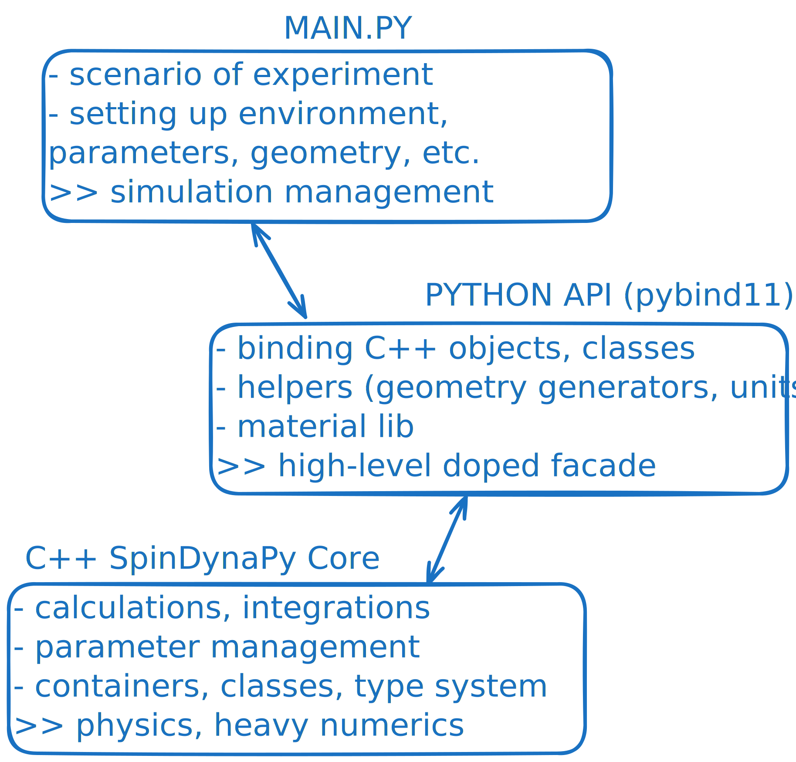
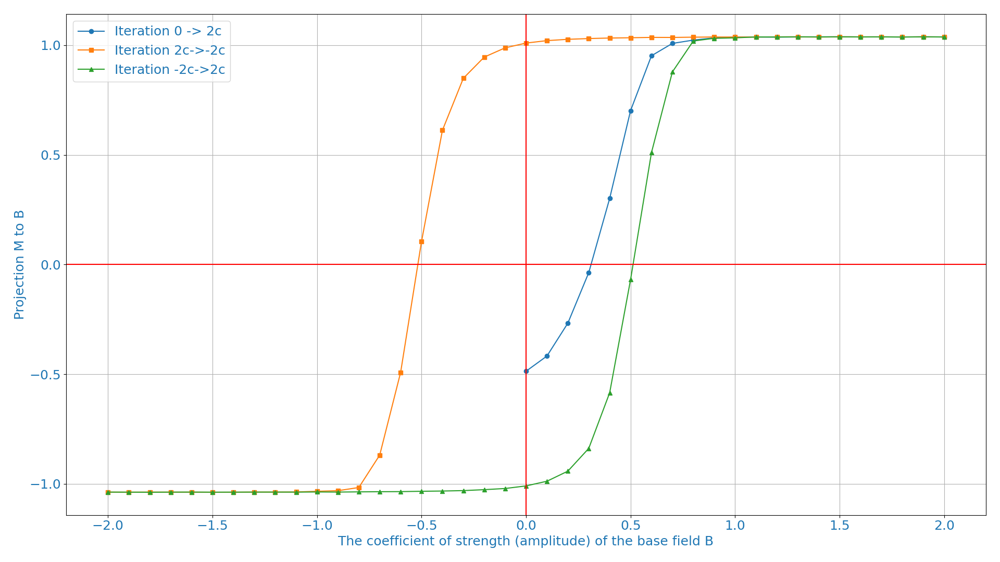
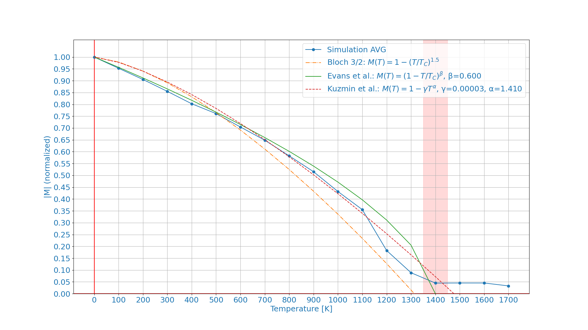
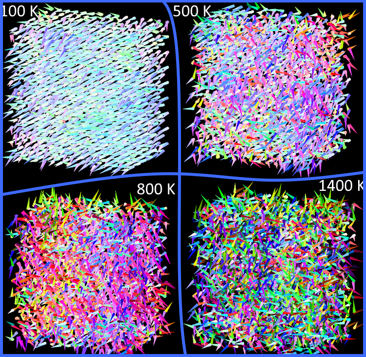

***WIP***

# SpinDynaPy – atomistic spin‑dynamics toolkit
> *High‑performance C++20 core, elegant Python 3.12 interface.*

SpinDynaPy (codename **umag**) is a research‑grade framework for **atomistic modelling of spin dynamics**.
It marries a **multithreaded C++20 backend** (exposed through **pybind11**) with the ergonomics of modern
Python scientific tooling.  The code follows SI‑units throughout, remains thread‑safe under OpenMP and is designed
for **clarity, extensibility & reproducibility**.

- **Speed where it matters**
  All core algorithms — interaction fields, numerical integrators, geometry traversal — are implemented in modern C++20

- **Flexibility where you need it**
  The exposed Python 3.12 API provides full access to materials, solvers, registries, and simulation loops. Anything can be scripted, debugged, or modified in-place — without recompiling.

- **Strict SI unit system**
- **Transparency and extensibility**

---

With the rise of nanoscale spintronic applications, micromagnetic models are becoming outdated, giving way to atomistic simulations capable of capturing atomic-scale phenomena.

They offer direct access to spin–spin interactions, thermal fluctuations, and structural disorder at the atomic scale — all critical for next-generation magnetic materials.

## Math model

While ab initio quantum calculations provide high accuracy, they quickly become computationally prohibitive in both time and memory even for modestly sized spin systems. To overcome this, and under well-justified conditions such as large total spin and weak entanglement, we adopt a quasi-classical approach represented by normalized vectors associated with generalized magnetic moments localized at the sites of a crystal lattice. This transition from fully quantum to effective classical dynamics remains an active area of research.

In the quasi-classical regime, each spin $\vec S_i ∈ R^3$ is treated as a normalized vector of unit length $|\vec S|= 1$, representing the direction of the magnetic moment at lattice site $i$: 

$` \Large
\Large \vec S_i = {\vec \mu_i}/{\mu_i}
`$

<details>
<summary> Conditions for the quasi-classical approximation detailed</summary>

The use of classical spin vectors $\vec S_i$ in place of quantum operators $\hat{\vec S}_i$ is justified under the following physical and computational conditions:

- Large spin magnitude

  The spin per atom exceeds $\hbar N/2$ (e.g. $S = 1, 3/2, \dots$), and the total system spin satisfies $S_{\text{tot}} \gg 1$. This suppresses quantum fluctuations as

  $` \Large
  \frac{\Delta S}{S} \sim \frac{1}{\sqrt{S_{\mathrm{tot}}}} \ll 1
  `$

  ---

- Use of semi-empirical constants

  Instead of explicitly solving the quantum many-body problem, we introduce material-specific constants — such as the exchange integral $\mathcal{J}_{ij}$ — obtained either from experiment or ab initio calculations.

  $` \Large
  \mathcal{J} = \int \psi_i^*(\vec r_i) \, \psi_j(\vec r_i) \,
  \mathcal{H}_{\mathrm{exch}}(\vec r_i, \vec r_j) \,
  \psi_j^*(\vec r_j) \, \psi_i(\vec r_j) \, d\vec r_i \, d\vec r_j
  `$

  One example is the semi-empirical exchange parameter, related to the Curie temperature $T_C$ via: $\mathcal{J} = \frac{3 k_B T_C}{2 z S (S + 1)}$, one may include a specified DFT-corrector $\epsilon$ $\mathcal{J}^* = \frac{\mathcal{J}}{\epsilon}$

  ---

  To connect this quantum exchange with the quasi-classical spin model, we start from the operator Hamiltonian:

  $` \Large
  \mathcal{H}_{\mathrm{exch}, ij}
  = -\mathcal{J}_{ij} \, \hat{\vec S}_i \cdot \hat{\vec S}_j
  = -\mathcal{J}_{ij} \left( \frac{\hbar}{g \mu_B} \right)^2 \hat{\vec \mu}  _i^s \cdot \hat{\vec \mu}_j^s
  = -\mathcal{J}'_{ij} \, \hat{\vec \mu}_i^s \cdot \hat{\vec \mu}_j^s
  `$

  Here $\hat{\vec \mu}_i^s$ is the spin magnetic moment operator, and the replacement uses $\hat{\vec \mu}_i^s = -g \mu_B \hat{\vec S}_i / \hbar$.

  Taking the quasi-classical limit (expectation values, neglecting quantum correlations), we replace operators with classical vectors:

  $` \Large
  \mathcal{H}^{q\text{--}cl}_{\mathrm{exch}, ij}
  = -\mathcal{J}'_{ij} \, \vec \mu_i^s \cdot \vec \mu_j^s
  = -\mathcal{J}'_{ij} \cdot \left( \frac{1}{\mu_i \mu_j} \right) \cdot   \vec S_i \cdot \vec S_j
  = -\mathcal{J}''_{ij} \cdot \vec S_i \cdot \vec S_j
  `$

  where $\mathcal{J}''{ij}$ is the effective coefficient in the classical Heisenberg Hamiltonian.

  ---

- Thermal dominance at room temperature 

  For $T \sim 300$ K, the thermal energy $k_B T$ often exceeds quantum level spacing $\hbar\omega$ ($k_B T \gg \hbar \omega$)

  ---

- Atomic localization of $d$-electron's wave functions

  The de Broglie wavelength of a localized $d$-electron is on the order of an angström: $\lambda_{\mathrm{dB}} \sim \frac{h}{p} \sim \mathring{A}$. This is comparable to the lattice constant, so the electron wavefunction is spatially localized near atomic sites, effectively forming standing-wave modes.

  ---

- Ehrenfest theorem and operator dynamics

  For a clean derivation, one starts with the quantum spin equation:

  $` \Large
  \frac{d\hat{\vec S}_i}{dt} = \frac{1}{i\hbar} [\hat{\mathcal{H}}, \hat{\vec S}_i]
  `$

  and under ensemble averaging and weak entanglement, applies the Ehrenfest theorem:

  $` \Large
  \hat{\vec S}_i \mapsto \vec S_i \quad \Rightarrow \quad \frac{d\vec S_i}{dt} = \vec S_i \times \vec H^{\mathrm{eff}}_i
  `$

  Optionally, one may extend the Hamiltonian to a non-Hermitian form to include damping or open-system effects (e.g. thermal reservoirs, losses).

  ---

</details>

### Deterministic model

The time evolution of the spin system is governed by the Landau–Lifshitz–Gilbert (LLG) equation:

$` \Large
\frac{d\vec S_i}{dt} = -\frac{\gamma}{1+\alpha^2}\Bigl(\bigl[\vec S_i \times \vec B_i^{\mathrm{eff}}\bigr]
                          + \alpha\, \bigl[ \vec S_i \times \bigl[\vec S_i \times \vec B_i^{\mathrm{eff}}\bigr]\bigr]\Bigr)
`$

### Energy Hamiltonian

The effective field $\vec B^{eff}_i$ acting on spin $i$ encodes the collective influence of all interactions with the surrounding system. It is defined as the variational derivative of the Hamiltonian with respect to the spin direction:

$` \Large
\vec B^{\mathrm{eff}}_i = -\frac{1}{\mu_i} \frac{\partial \mathcal{H}}{\partial \vec S_i}
`$

The total energy (Hamiltonian) of the system is given by:

$` \Large
\mathcal{H} = \mathcal{H}_{\mathrm{ex}} + \mathcal{H}_{\mathrm{ani}} + \mathcal{H}_{\mathrm{dip}} + \mathcal{H}_{\mathrm{appl}}
`$

<details>
<summary>Hamiltonian Terms detailed</summary>

Each term corresponds to a distinct physical mechanism:

- **Exchange interaction** (nearest-neighbour Heisenberg form):

  $` \Large
  \mathcal{H}_{\mathrm{ex}} = -\sum_{\langle i,j \rangle} \bigl(\mathcal{J}_{ij} \, \vec S_i \cdot \vec S_j\bigr)
  `$

- **Anisotropy** (due to crystal field or spin–orbit coupling)
    - **uniaxial** (universal axis)

      $` \Large
      \mathcal{H}_{\mathrm{anis}} = -K_u \sum_i (\vec S_i \cdot \vec n)^2
      `$

- **Dipole-Dipole interaction** (long-range, all dipoles)

  $` \Large
  \mathcal{H}_{\mathrm{dip}} = \frac{\mu_0}{4\pi} \sum_{i \ne j} \left( \frac{ \vec \mu_i \cdot \vec \mu_j}{r_{ij}^3} - \frac{3(\vec \mu_i \cdot \vec r_{ij})(\vec \mu_j \cdot \vec r_{ij})}{r_{ij}^5} \right)
  `$

  This expression corresponds to the full, direct pairwise dipole field, calculated for all $i \ne j$. It scales as $\mathcal{O}(N^2)$, and becomes the dominant bottleneck for large systems.

  To mitigate this, one may instead compute the demagnetization term.

    - **Demagnetization term** (with unaccounted dipoles)

      In real systems, the total dipolar interaction can be prohibitively expensive to compute explicitly. As an alternative, one can approximate the effect of all *unaccounted dipoles* through a demagnetization field derived from macroscopic magnetostatics:

      $` \Large
      \vec B_{\mathrm{demag}} = -\hat N \cdot \vec M
      `$

      $` \Large
      \vec B = \vec B_{\mathrm{appl}} + \vec B_{\mathrm{demag}}
      `$
  
      This approach treats the system as a magnetized body with uniform magnetization $\vec M$ and uses the shape-dependent tensor $\hat N$ to account for internal field contributions.
  
      Therefore, we define our demagnetization energy via   conditional treatment:

      $` \Large
      \mathcal{H}_{\mathrm{demag}, i} =
      \begin{cases}
        -\mathcal{H}_{\mathrm{dip\text{-}dip}, i}, & \text{\small all} \\
        -\mathcal{H}_{\mathrm{self\text{-}factor}}^{\mathrm{shape}} + \mathcal{H}_{\mathrm{dip\text{-}dip}, i}, & \text{\small with unacc.}
      \end{cases}
      `$

      In the second case, we *at least retain* the contribution from neighboring dipoles, which dominate the local interaction, while distant ones may be truncated (too large system), averaged (macrocell's intrinsic dipoles), or heuristically folded into the shape-field.

      We correct for the missing internal interactions (e.g. within a macrocell) by subtracting a *self-demagnetization term (shape-factor)* that accounts for the finite volume of the cell (for an individual spin $i$, we may still define an effective demagnetization field using its own moment $\vec \mu_i$ and an effective volume $V_{\mathrm{cell}}$ assigned to the atom):
      
      $` \Large
      \vec B^{\mathrm{demag}}_{p} \approx - \vec \zeta_{\mathrm{intrinsic}} + \vec B^{\mathrm{dip}}_{p} \approx - \frac{\mu_0}{3} \cdot \frac{ \vec M_p }{V_{\mathrm{cell}} } + \vec B^{\mathrm{dip}}_{p}
      `$

- **Zeeman term** (external field coupling)

  $` \Large
  \mathcal{H}_Z = -\sum_i \bigl(\vec \mu_i \cdot \vec B_{\mathrm{ext}}\bigr)
  `$

- **Thermal term** (stochastic Langevin field)
  
  This noise term is added to $\vec B^{\mathrm{eff}}_i$ to model temperature-dependent fluctuations with Gaussian noise ($\vec \xi ∈ [0, 1]$):

  $` \Large
  \vec B^{\mathrm{eff}}_i = -\frac{1}{\mu_i} \frac{\partial \mathcal{H}}{\partial \vec S_i} + B^{\mathrm{eff}}_{\mathrm{th},i} = -\frac{1}{\mu_i} \frac{\partial \mathcal{H}}{\partial \vec S_i} + \sqrt{ \frac{2 \alpha k_B T}{\gamma \mu_s \, \Delta t} } \cdot \vec \xi
  `$

</details>

### Numerical integrators

To numerically integrate the LLG equation, we employ explicit time-stepping methods.

- **Euler method** is the simplest first-order integrator

  $` \Large
  \vec S_i(t + \Delta t) = \vec S_i(\vec B, t) + \Delta t \cdot {\Delta \vec S_i(\vec B, t)}
  `$
  
  where

  $` \Large
  \Delta \vec S_i(\vec B, t) = - \frac{\gamma}{1 + \alpha^2} \left[\vec S_i \times \vec B_i^{\mathrm{eff}} + \alpha \, \vec S_i \times (\vec S_i \times \vec B_i^{\mathrm{eff}}) \right]
  `$

- **Heun method** (predictor–corrector) offers improved stability and second-order accuracy

  $` \Large
  \vec S_i^{\mathrm{pred}} = \vec S_i(t) + \Delta t \cdot \Delta \vec S_i(\vec B, t)
  `$

  $` \Large
  \vec S_i(t + \Delta t) = \vec S_i(t) + \frac{\Delta t}{2} \left( \Delta \vec S_i(\vec B, t) + \Delta \vec S'_i(\vec B', t) \right)
  `$

---

## Project

The project is structured as a layered hybrid of Python 3.12 and high-performance C++.

At the top level, users interact with a clean and expressive Python API. Under the hood, all performance-critical logic — including field updates, interaction computation, and integration steps — is implemented in modern C++20 with multithreading support.



### Dependencies

#### 🏗 Build

Before building the project, ensure:
- You have Python 3.12 selected (e.g. via `pyenv`, `apt`, or `conda`) (`which python`);
- A C++20‑compliant compiler (e.g. GCC 13+ or Clang 16+) is active (`g++ --version`);
- The Python development headers (`python-dev`) are installed.

```
C++
├─ C++20-compatible compiler  ── stdlib
├─ CMake                      ── build system for C++ core
│  ├─ Ninja                   ── (opt) build backend (faster)
│  └─ CPM.cmake               ── package manager for C++ libs
├─ fmt                        ── C++ ↔ Python bindings
├─ pybind11                   ── string formatting (log, dump)
├─ Eigen                      ── vector math (spins, fields)
├─ OpenMP                     ── multithreading backend
└─ Python 3.12 headers        ── required for embedding (lib + dev)

Python for library building
├─ setuptools (pip)           ── builds the Python extension
├─ numpy                      ── C-based math
├─ poetry                     ── manages environment + dependencies
├─ black                      ── (opt) formats generated .pyi stubs
└─ pybind11-stubgen           ── (opt) generates .pyi from pybind11 bindings
```

<details>
<summary>🐧 Ubuntu 24.04 LTS example setup</summary>

Update the system if its necessary

```sh
sudo apt update
sudo apt upgrade -y
```

Install the build dependencies

```sh
sudo apt install build-essential cmake ninja-build make pkg-config git cmake-format python-dev libffi-dev tk-dev tcl-dev liblzma-dev clang-format clangd
```

Modern C++ compilers (e.g. GCC)

```sh
sudo add-apt-repository ppa:ubuntu-toolchain-r/test -y
sudo apt update
sudo apt install -y gcc-13 g++-13
```

Switch default compiler (e.g. to GCC-13 supported C++20)

```sh
sudo update-alternatives --install /usr/bin/g++ g++ /usr/bin/g++-13 100
sudo update-alternatives --install /usr/bin/gcc gcc /usr/bin/gcc-13 100
sudo update-alternatives --install /usr/bin/g++ g++ /usr/bin/g++-12 20
sudo update-alternatives --install /usr/bin/g++ g++ /usr/bin/gcc-12 20
```

Install and switch Python 3.12 Interpreter (e.g. via `pyenv`)

```sh
pyenv install 3.12.3
pyenv global 3.12.3
```

Install poetry (e.g. via `pipx`)

```sh
pipx install poetry
poetry config virtualenvs.in-project true
```

</details>

Once all dependencies are in place:

```sh
make build-all # or "make build-release" for only building C++ lib
```

#### 🐍 Runtime
```
Runtime (main.py in-place)
├─ make             — (opt) shortcuts
└─ CPython 3.12
    ├─ poetry       — package managing
    ├─ spindynapy   — out built module
    ├─ matplotlib   — (opt) graphs
    └─ numpy        — required at runtime for geometry and array handling
```

Once all dependencies are in place:
```sh
make run # or just python main.py inside environment
```

### Core Features

#### 🧠 Physics
- LLG solver
- Fully extensible Hamiltonian
- Thermal fluctuation modelling
- Macrocell support
- Flexible geometry usage & generation
- Strict SI-unit consistensy

#### 🧮 backend & 🐍 interface
- OpenMP C++20 OOP
- Type- thread-safe containers
- Ergonomic Python API
- Visualization-ready dumpers
- Black-box simulation loop
- No usage limitations
- Fully Stubbed with `.pyi`

> see [Features that would like to be added](https://github.com/ilyata76/umag/issues/4)

### Known core issues

Physics
- Only LLG
- Single-spin-per-site model
- No spin–phonon coupling
- Anisotropy model limited to uniaxial
- No ab initio pipeline
- No DMI, exch. bias, etc.
- No periodic conditions
- Macrocell caching is approximate

Technical
- ***slow***
- No GPU acceleration
- Rigid geometry
- Pairwise dipole calculation is O(N²)

> see [Issues that would like to be fixed](https://github.com/ilyata76/umag/issues/4)

## Quick start

Simulations are typically defined as standalone Python scripts and executed in-place via make run or poetry run python main.py. This section outlines a minimal working example using the modern API.

```sh
git clone --recursive https://github.com/ilyata76/umag.git
cd umag
code main.py
```

### Module structure

The simulation is implemented as a Python script executed in a local environment. All core components are exposed through the `spindynapy.cartesian` module, which provides interfaces for material definition, geometry construction, solver selection, and interaction registration.

Additional submodules provide utilities for unit conversion (`spindynapy.unit`), material libraries (`spindynapy.matlib`), structured logging (`spindynapy.logger`), and geometry management (`spindynapy.geometry`).

```python
from spindynapy.cartesian import Geometry, LLGSolver, Simulation, ...
from spindynapy.unit import XYZ, nano, femto
from spindynapy.matlib import mat_lib, MaterialEnum, lattice_lib, ...
```

### Material definition and registration

The simulation begins with the explicit definition of magnetic materials. Each material is described by a set of physical parameters: saturation magnetization `Mₛ`, exchange constant `𝒥`, etc., all expressed in SI units.

Materials are instantiated via the Material constructor. Example:

```python
from spindynapy.cartesian import Material

cobalt = Material(
    material_number=MaterialEnum.COBALT.value,  # [int]
    exchange_constant_J=5e-21,  # [J]
    atomic_magnetic_saturation_magnetization=1.72,  # [μB]
    damping_constant=0.5,  # [0-1 float]
    unit_cell_size=cell_size_lib[MaterialEnum.COBALT].unit,
    atom_cell_size=cell_size_lib[MaterialEnum.COBALT].atom,
    gyromagnetic_ratio=constants.FREE_SPIN_GYROMAGNETIC_RATIO,  # [rad/s/T]
    anisotropy=UniaxialAnisotropy(np.array([0.0, 0.0, 1.0]), 6.69e-24),  # [J/atom]
)
```

For convenience, the framework also provides a predefined material library (`mat_lib`) along with associated crystallographic constants (`lattice_lib`) and volumetric estimates (`cell_size_lib`). Each material is identified by an enumerated label MaterialEnum, which acts as a canonical registry key across the simulation.

If necessary, material parameters can be modified before registration. For example, to override the exchange constant of cobalt:

```python
mat_lib[MaterialEnum.COBALT].exchange_constant_J = 5.5e-21
```

Once modified, the material is inserted into a simulation-specific *immutable* MaterialRegistry:

```python
from spindynapy.matlib import mat_lib
from spindynapy.cartesian import MaterialRegistry

material_registry = MaterialRegistry({
    MaterialEnum.COBALT.value: mat_lib[MaterialEnum.COBALT]
})
```

This registry serves as the authoritative source of material data throughout the simulation pipeline, and all geometry definitions must reference materials declared therein.

### Geometry

Once the material registry has been established, the next stage is to construct the atomistic geometry of the system. The framework provides a high-level geometry manager (`NumpyGeometryManager`) capable of generating various lattice types with predefined orientation and size.

Each generated lattice site is assigned a position vector in 3D space and a magnetic moment direction. In the monomaterial case, all sites are initialized with the same material number, which must correspond to an entry previously declared in the `MaterialRegistry`. This function returns a structured array containing all atomic moments as an **numpy array**.

```python
from spindynapy.geometry import NumpyGeometryManager
from spindynapy.unit import XYZ, nano
from spindynapy.materials import lattice_lib, MaterialEnum
from spindynapy.matlib import mat_lib

geometry_data = NumpyGeometryManager.generate_hcp_monomaterial_parallelepiped(
    lattice_constant=lattice_lib[MaterialEnum.COBALT],
    size=XYZ(nano(5.0), nano(5.0), nano(5.0)),
    material_number=mat_lib[MaterialEnum.COBALT].get_number(),
    initial_direction=None,  # or a specific XYZ-vector
    base_shift=None          # optional XYZ-offset
)
```

These data are then passed to the Geometry class, which constructs an internal representation of the system:

```python
from spindynapy.cartesian import Geometry

geometry = Geometry(
    moments=geometry_data,
    material_registry=material_registry
)
```

<details>
<summary>In addition to NumPy-based construction, the framework also supports geometry initialization via a standard Python list of Moment objects. </summary>

This approach allows full manual control over each site, which is useful for importing experimental data or constructing heterogeneous systems

```python
from spindynapy.cartesian import Moment, Coordinates, Direction
from spindynapy.matlib import mat_lib

moments = [
    Moment(position=Coordinates(0.0, 0.0, 0.0),
           direction=Direction(0.0, 0.0, 1.0),
           material=mat_lib[MaterialEnum.COBALT]),
    ...
]

geometry = Geometry(
    moments=moments,
    material_registry=material_registry
)
```

</details>

### Interactions

All energy contributions in the system are defined by interaction potentials, which are implemented as subclasses of the `AbsrtactInteraction` base class. Each such class represents a specific term that enters the simulation through the effective field and energy computation. `..Interaction` objects are instantiated explicitly and are immutable configuration carriers.

To register active potentials in the system, the user constructs an `InteractionRegistry`:

```python
from enum import Enum
from spindynapy.cartesian import (
    InteractionRegistry,
    ExchangeInteraction,
    DipoleDipoleInteraction,
    AnisotropyInteraction,
    ExternalInteraction
)
from spindynapy.unit import nano

class InteractionEnum(Enum):
    EXCHANGE = 0
    DIPOLE = 1
    ANISOTROPY = 2
    EXTERNAL = 3

interaction_registry = InteractionRegistry(
    {
        InteractionEnum.EXCHANGE.value: ExchangeInteraction(cutoff_radius=nano(0.4)),
        InteractionEnum.DEMAGNETIZATION.value: DipoleDipoleInteraction(
            cutoff_radius=nano(10), strategy="cutoff"
        ),
        InteractionEnum.ANISOTROPY.value: AnisotropyInteraction(),
        InteractionEnum.EXTERNAL.value: ExternalInteraction(1, 0, 0),
    }
)
```

### Simulation setup

All numerical solvers in the system are derived from the base class `AbsrtactSolver`. This defines the interface for stepping the system forward in time and managing spin updates. Each solver internally uses a `AbstractFieldUpdater` to compute effective fields. The updater encapsulates the strategy for evaluating all registered interactions and applying them to the geometry (e.g. `OMPFieldUpdater`).

The `LLGSolver` is a specific implementation of solver that encodes the Landau–Lifshitz–Gilbert equation. It supports multiple numerical integration schemes, configured via the `SolverStrategy` enum:

```python
from spindynapy.cartesian import LLGSolver, SolverStrategy

solver = LLGSolver(strategy=SolverStrategy.HEUN)
```

To run a simulation, all components — geometry, solver, material registry, interaction registry, and time step — are passed to the Simulation object. This class **holds the complete state of the system and provides the interface for stepping and data output**:

```python
from spindynapy.cartesian import Simulation
from spindynapy.unit import femto

simulation = Simulation(
    geometry=geometry,
    solver=solver,
    material_registry=material_registry,
    interaction_registry=interaction_registry,
    dt=femto(1.0)
)
```

`Simulation` is the only object that mutates state and executes time integration. It owns all memory, dispatches field updates, advances the system, stores step data, and provides access to results.

### Simulation control

Once the `Simulation` object is constructed, it provides two primary methods for evoluting the system: `simulate_one_step` and `simulate_many_steps`. Both methods execute one or more time steps using the configured solver and field updater, and optionally store intermediate results:

```python
for i in range(1, steps + 1):
    simulation.simulate_one_step(
        save_step=(i % 1 == 0),
        update_macrocells=(i % 1 == 0)
    )
# Or, for batch execution:
# simulation.simulate_many_steps(
#     steps=100,
#     save_every_step=1,
#     update_macrocells_every_step=1
# )
```

All saved steps are stored inside the simulation in order of execution. The list of steps can be retrieved via `get_steps()`, which returns a list of `SimulationStepData` objects: 
```
steps = simulation.get_steps()
```

All further postprocessing — including formatting, file export, or visualization — operates on these `SimulationStepData` objects.

Results are exported using the SimulationPrinter, which formats simulation steps into text representations suitable for analysis or visualization. It is constructed using the same MaterialRegistry and InteractionRegistry as the simulation:

```python
from spindynapy.cartesian import SimulationPrinter

printer = SimulationPrinter(
    material_registry=material_registry,
    interaction_registry=interaction_registry
)
```

For each saved step, the printer can generate `.vvis` and `.shot` dumps. The `.vvis` format encodes position and spin orientation (can be spicified with `format` string); `.shot` includes full state: directions, fields, per-term energies, means.

```python
for step_data in simulation.get_steps():
    data_vvis = printer.vvis(
        step_data,
        format=(
            "{material}\t0\t{coord_x:.3f}\t{coord_y:.3f}\t"
            "{coord_z:.3f}\t{dir_x:.3f}\t{dir_y:.3f}\t{dir_z:.3f}"
        ),
        print_header=True,
    )
    data_shot = printer.shot(step_data)

    with open(f"sconfiguration-{step_data.step:08d}.vvis", "w") as f:
        f.write(data_vvis)

    with open(f"stepdata-{step_data.step:08d}.shot", "w") as f:
        f.write(data_shot)
```

Global observables — such as energy, magnetization, and per-interaction terms — can be exported *as a time series* via the printer:

```python
data_ts = printer.time_series(
    simulation,
    (
        "{step}\t{sim_time:.3e}\t{full_energy:.3e}\t"
        "{magnetization:.3f}\t{magnetization_x:.3f}\t{magnetization_y:.3f}\t{magnetization_z:.3f}\t"
        "{energy_0:+.5e}\t{energy_1:+.5e}\t{energy_2:+.5e}\t{energy_3:+.5e}"
    ),
)
with open("TS.txt", "w") as f:
    f.write(data_ts)
```

The simplicity and flexibility Python API — with explicit control over configuration, execution, and data access — make it well-suited for building more advanced applications

### Execution

After the C++ backend is compiled and the Python extension module is built in-place, the simulation can be launched via:

```sh
make run
```

or simply by running the Python file through any mechanism, as long as the spindynapy package is available in the environment.

## Examples (PRE 0.1.0)

### Dimer validation


- Manual calculation directly evaluates energy potentials using analytical expressions for $E(\vec \mu_i, \vec \mu_j)$;
- Simulation computes effective fields $\vec B^{\mathrm{eff}}_i$ for each interaction and derives the potential energy via $E_i = - \epsilon \, \vec \mu_i \cdot \vec B^{\mathrm{eff}}_i$

| Term             | Formula                                                                                                                                                        | Manual (J)               | Simulated (J)                | Δ (%)   |
| ---------------- | -------------------------------------------------------------------------------------------------------------------------------------------------------------- | ------------------------ | ---------------------------- | ------- |
| Exchange         | $E_{\mathrm{ex}} = -\mathcal{J} \cdot \vec S_1 \cdot \vec S_2$                                                                                                 | $\approx 0$              | −9.56396e−38                 | ≈ 0%    |
| Dipole–Dipole    | $E_{\mathrm{dip}} = \frac{\mu_0}{4\pi r^3}\left( \vec \mu_1 \cdot \vec \mu_2 - 3 \frac{(\vec \mu_1 \cdot \vec r)(\vec \mu_2 \cdot \vec r)}{r^2} \right)$       | $+1.052 \times 10^{-23}$ | $+1.05337 \times 10^{-23}$   | ≈ 0.1%  |
| Anisotropy       | $E_{\mathrm{anis}} = -K_u (\vec S_1 \cdot \vec n)^2 - K_u (\vec S_2 \cdot \vec n)^2$                                                                           | −1.000e−24               | −1.00000e−24                 | 0%      |
| Zeeman           | $E_Z = -\mu \cdot (\vec S_1 + \vec S_2) \cdot \vec B$                                                                                                          | +1.2029e−24              | +1.20336e−24                 | ≈ 0.04% |
| **Total energy** | $E_{\mathrm{total}} = \sum_i E_i$                                                                                                                              | +1.07371e−23             | +1.07371e−23                 | ≈ 0%    |

This benchmark confirms that the simulation backend correctly computes both effective fields and resulting energies across all interaction terms, even in borderline configurations.

### Hysteresis loop

Nickel $`10 \times 10 \times 0.1 \, nm^3`$ (rough monolayer) with B at $45 \degree$ to easy axis



### Curie

Cobalt $`4 \times 4 \times 3 \, nm^3`$



<div style="text-align:center">

</div>

### Relaxation to vertex

Cobalt $`30 \times 30 \times 0.1 \, nm^3`$ (rough monolayer) with "naive" macrocell optimization


